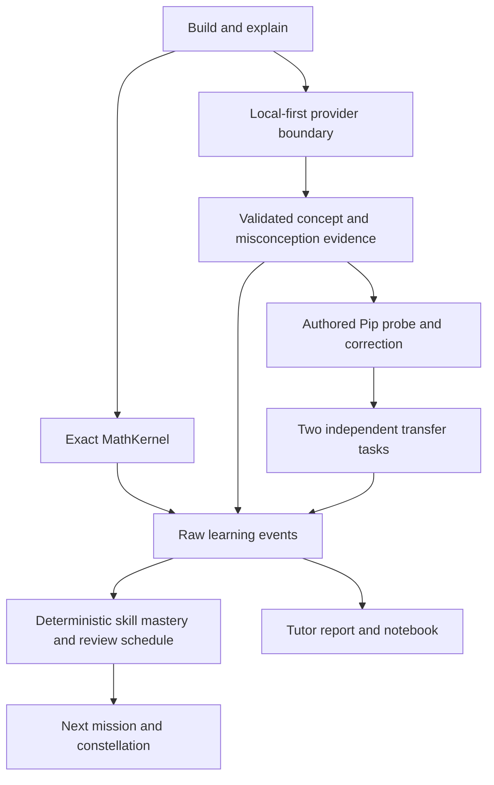

# PIP

## The AI apprentice you teach to learn

**Most math games test whether a child can get the answer. Pip tests whether they understand it well enough to teach it.**

**BUILD → EXPLAIN → CORRECT → TRANSFER → MASTERY**

Pip is a curious creature rebuilding a floating observatory. The learner builds a mathematical idea, explains it, catches Pip’s mistake, teaches a correction, and proves the idea in two different representations. The hero experience targets grades 3–5; the skill graph is designed to expand across K–5.

## What makes Pip different

- Direct manipulation: equal fraction pieces, number lines, crystal arrays, and base-ten blocks.
- An explanation changes the authored misconception Pip tries. A missing concept produces a follow-up question.
- A visible notebook moment: Pip revises its idea before the learner attempts independent transfer.
- Mastery is recomputed from structured evidence in code. No language model sets a mastery score.
- A skill constellation, daily teaching quest, 1/3/7-day reviews, and an explainable next mission.
- Original animated Pip, restored observatory, synthesized chimes, and optional speech.
- A grown-up report and technical lab with actual evidence and measured provider results.

## Run on this Windows PC

```powershell
& "C:\Users\panju\OneDrive\Desktop\nerdy\scripts\start-demo.ps1"
```

Wait for **PIP IS READY**. It launches the production app on port 3176, warms local Qwen3-8B through llama.cpp and faster-whisper/base.en on CPU, verifies actual structured inference and forces cloud OFF. The verified GPU is an RTX 5070 Ti with 16 GB VRAM.

[Live presentation](http://localhost:3176/demo?presentation=1&reset=1&provider=llamacpp) · [Technical Lab](http://localhost:3176/lab)

Stop: `npm run stop:demo`. Safe authored recording: stop first, then `npm run start:safe`. Optional verified Ollama alternative: `npm run start:demo -- --ollama`. Do not load both inference models together.

## Local-first AI and speech

| Provider | Actual status on this Windows PC |
|---|---|
| llama.cpp b11026 / official Qwen3-8B Q4_K_M | Default; strict live explanation, correction, canary and context verified; 37/37 layers on GPU |
| Ollama 0.34.2 / qwen3:8b | Same official GGUF imported locally; structured explanation, misconception and correction verified |
| Qwen3-14B | Optional configuration only; not installed or benchmarked |
| faster-whisper 1.2.1 / base.en | CPU int8; synthetic browser microphone → real transcription → Qwen → mastery verified |
| Authored demo | Deterministic fallback; complete browser suite verified |
| OpenAI | Optional server opt-in adapters retained; no live cloud test |

No paid key is required. Local services bind loopback. Tap **Talk to Pip**, then **Stop recording**, edit the text, and submit. Audio is capped at 30 seconds and not retained. Typed teaching is always available. Actual human microphone quality must still be checked in the room.

Strict local mode blocks failed evaluations instead of silently substituting authored evidence. Cloud requires explicit server opt-in; adding a key alone never enables it. A public host cannot reach this laptop’s localhost services.

## How it works



Models return bounded concept IDs, misconception IDs, confidence, and a classification. Exact rational arithmetic validates fractions; pure integer rules validate arrays/place value. Zod rejects malformed or cross-world model output. Non-strict failures use authored content; strict verification shows a retry and preserves the current stage. Hidden model reasoning and raw learner text are not logged.

## Learning model

Raw events track skill, representation, correctness, independence, attempts, hints, concepts, misconceptions, and time. The engine derives procedural, conceptual, explanation, correction, transfer, and retention estimates. Hints and guesses reduce reliability. Mastery needs an overall threshold plus conceptual/explanation/correction/transfer gates and **two distinct independent transfer activities**. Review occurs after 1 day, then 3 and 7 days following successful delayed recall. A missed review carries no punishment.

These are transparent product heuristics, not a validated assessment. Fixed authored tasks can become familiar; classroom validation and a larger equivalent-item bank are future work. Fifteen graph nodes are authored; twelve map to playable activities, with some sharing an existing lesson. Three future activities are labelled accordingly. See [learning design](docs/learning-design.md).

## Tests

```sh
npm run lint
npm run typecheck
npm test
npm run evaluate
npm run evaluate:local   # requires an installed, warmed local model
npm run test:e2e
npm run build
npm run build:vercel
```

The deterministic harness covers 2,201 exact math cases, eight synthetic learner traces, five schema cases, and 19 authored explanation fixtures. Unit tests add provider policy and evidence/review invariants. Browser tests cover hero and secondary worlds, adaptive probes, two transfers, persistence, reset, failures, microphone lifecycle, provider selection, constellation updates, and seven viewport sizes. 

Playwright uses installed Chrome on macOS; elsewhere run `npx playwright install chromium`. Tests normally start a dedicated server on port 3173. `PIP_TEST_URL` targets an existing server.

## Architecture and project structure

Next.js App Router conventions, React 19, strict TypeScript. The default Vinext/Vite build emits a Cloudflare Worker. `build:vercel` uses standard Next.js. The old deleted Sites registration is not required or recreated. Native document links work around a beta-adapter navigation issue, restoring validated browser progress after navigation.

```text
app/                  Pages and guarded API routes
components/game/      Teaching loop, constellation, notebook, reports
components/pip/       Original animated character
content/              Lessons, skill graph, authored probes, prompts
lib/math/             Exact mathematical authority
lib/ai/               Provider adapters and bounded reasoning contracts
lib/learning/         Raw evidence, mastery and mission selection
lib/persistence/      Validated device-local session repository
lib/speech/           Browser WAV conversion and local speech configuration
scripts/              Doctor, demo, evaluation, speech and build helpers
tests/                Unit and browser regression tests
docs/                 Architecture, learning design, QA and submission
```

See [architecture](docs/architecture.md), and [third-party notices](THIRD_PARTY_NOTICES.md).

## Privacy and deployment

Anonymous progress stays in validated browser localStorage. The adult view exports or clears it. No recordings, raw explanations, names, emails, or student profiles are retained by Pip. Model providers receive the current explanation only when selected and permitted; configured cloud provider terms apply. Telemetry retains provider/model, timing, fallback status, and bounded evidence summaries.

Both build targets can run without a key. A public host can use authored demo mode or explicitly configured cloud processing; it cannot use this laptop’s local services. See [deployment](docs/DEPLOYMENT.md), [AI disclosure](AI_DISCLOSURE.md) and [submission copy](docs/SUBMISSION.md).

**Don’t ask AI for the answer. Teach it why.**

