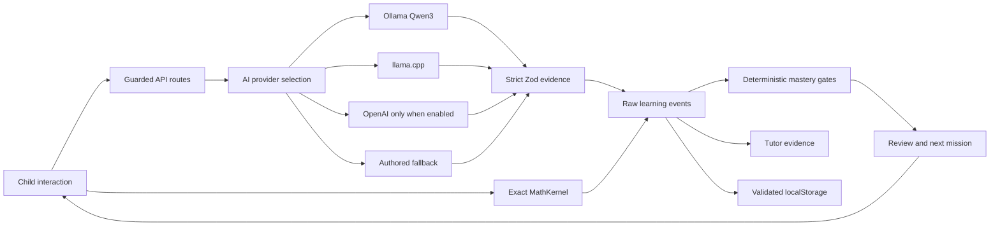

# Pip architecture

## Preserved foundation

The existing React/Next application, MathKernel, authored lessons, original character, storage adapter, build targets, OpenAI implementation, and failure handling remain. New modules add local inference, structured concept evidence, skill-level mastery, independent transfer, and review. Legacy world-level evidence remains readable for existing session history; current mastery/mission/tutor surfaces derive from `session.learning`.

## Model boundary

`AIProvider` exposes health and a schema-validated structured request. Ollama uses native JSON Schema and `think:false`; llama.cpp uses its JSON grammar format; OpenAI preserves strict Responses output and `store:false`. The compact wire schema expands into a public evidence contract. The model never receives writable mastery state and never provides the score that the learner sees. A fixed application rubric converts accepted concept evidence into event strength. Mathematical correctness and mastery thresholds are separate from language evaluation.

Local endpoints are loopback-only. Browser settings select a provider and model tier, not URLs or keys. Cloud fallback requires server consent. A health check establishes installation/configuration, not quality; warm-up verifies a synthetic inference. The technical lab distinguishes these states and displays session calls and actual fixture results.

## Evidence and missions

Evidence IDs include a run and stage, preventing double-counted successes while allowing later practice. The mastery model discounts hints/attempts and requires two distinct unassisted transfer activity IDs. Six estimates are derived: procedure, concepts, explanation, correction, transfer, retention. The overall score weights five; explanation is an additional minimum gate. The scheduler selects due review, unresolved misconception, an incomplete ready skill, then a ready successor. Prerequisites control constellation links. Future graph nodes have no fabricated activity.

Reviews require a delayed independent run; immediate replay is not retention. Due dates derive from mastery and successful recall. Repeated fixed tasks remain a limitation, not evidence of generalized long-term learning.

## Speech and privacy

The browser converts captured audio to mono PCM WAV in memory. The Next route forwards it to a loopback Python standard-library adapter, which invokes whisper.cpp in a temporary directory. It deletes audio and transcript on success/failure/timeout. No FFmpeg redistribution. Optional cloud speech uses the same explicit server policy. Browser speech synthesis uses device voices when available; subtitles and typed input remain complete.

## Persistence and deployment

Version-one saved sessions are validated and extended with defaulted fields; corrupt storage resets safely. No database is required. Device-local data is not an authoritative multi-device assessment record. The app can emit a Worker or standard Next production build. Loopback AI on a hosted server refers to that host, so a public server requires its own inference service or permitted cloud/demo configuration. No hosting registration is embedded.
